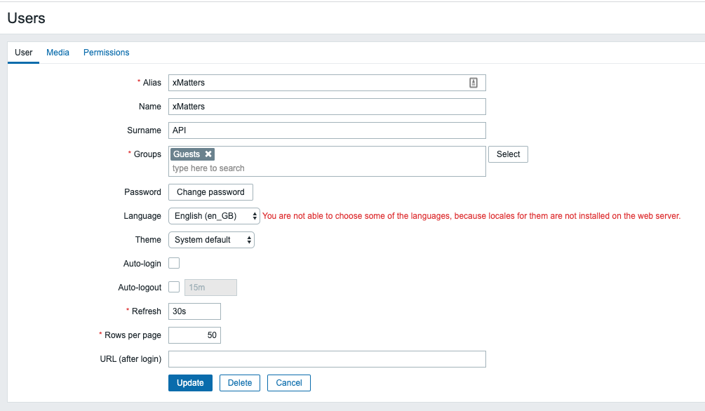
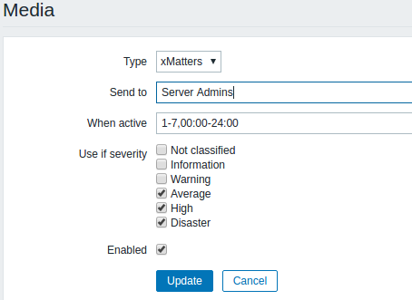
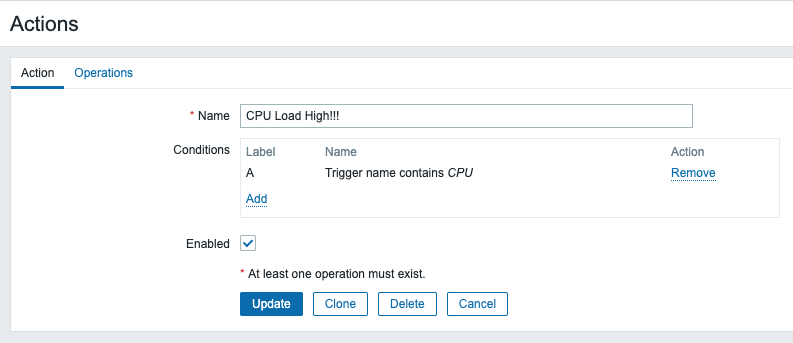
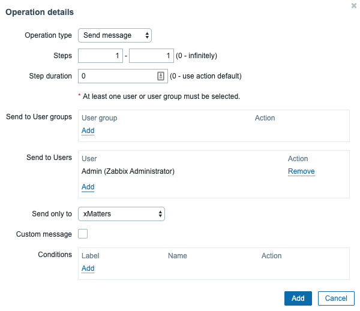

# Zabbix
[Zabbix](https://www.zabbix.com) is a mature and effortless enterprise-class open source monitoring solution for network monitoring and application monitoring of millions of metrics. This integration extends the alerting capabilities to use xMatters. 

---------

<kbd>
  
</kbd>

---------

# Pre-Requisites
* [Zabbix](https://www.Zabbix.com) (tested with version 5.0 but should support others)
* xMatters account - If you don't have one, [get one](https://www.xmatters.com)!

# Files
* [Zabbix.zip](Zabbix.zip) - The Workflow that receives Zabbix alerts

**Note**: To download, follow each link above and then click the **Download** button. Do not try to download by right-clicking the links.

# Installation

## xMatters set up

### Import the Workflow
To import the Workflow into xMatters:
1. Go to the xMatters **Workflows** tab
2. Click **Import**.

### Access URL
The Workflow has a URL that is required when configuring Zabbix.
To get the URL:
1. On the Zabbix Workflow, click one the **Flows** tab.
2. Click on the **Inbound from Zabbix** step and copy the initiation URL.
3. This URL will be used when setting up the xMatters Media type in Zabbix.

## Zabbix Setup

### Add xMatters API User
In order for xMatters to Acknowledge and add comments to a Zabbix event, it needs to be able to use the Zabbix API. In order to use the API, an xMatters user needs to be created in Zabbix for authentication:
1. In Zabbix, go to **Administration**, then **Users** and click **Create User**.
2. On the **User** tab, enter the following:
    * **Alias**: `xMatters`
    * **Name**: `xMatters`
    * **Surname**: `API`
    * **Groups**: &lt;select any group available in your instance of Zabbix&gt;
    * **Password**: &lt;set a password for this user&gt;
    * **Password (once again)**: &lt;repeat the previous password&gt;
        * Remember this password as it will be needed later

Click to reveal image.

<kbd>

</kbd>

3. On the **Permissions** tab, enter the following:
    * **User Type**: Zabbix Super Admin
4. Click **Add**.

### Create the xMatters Media Type
-----------------------------TODO-------------------------------------TODO
Upload the media file provided

1. Go to **Administration > Media Types** in Zabbix.
2. Click **Import** in the upper right corner.
3. Import the provided xMatters media type file.

### Create/Update Recipients

If you intend to send notifications directly to specific users

1. In Zabbix, go to **Administration**, then **Users** and select your user.
2. In the **Media** tab, click the **Add** link.
3. Enter the following:
    * **Type**: xMatters
    * **Send to**: &lt;the user's xMatters User ID&gt;
    * **When active**: `1-7,00:00-24:00`
    * **Use if severity**: &lt;select the severity levels you want to notify on&gt;
4. Click **Add**.
5. Repeat these steps for each of your users. 

Click to reveal image

<kbd>

</kbd>

If you intend to send notifications to groups in xMatters, you will need to create a **user** (not a group) in Zabbix to represent the xMatters group. You cannot use Zabbix groups as Zabbix expands those groups before calling xMatters, sending it to each user individually instead of following group shifts and escalations.

To send to notifications to xMatters groups

1. In Zabbix, go to **Administration**, then **Users** and click **Create User**.
2. On the **User** tab, enter the following:
    * **Alias**: &lt;the name of your xMatters group&gt;
    * **Groups**: &lt;either select a group that has access to all hosts that you'll want this xMatters group to get notifications on OR select any group and set the User Type to Zabbix Super Admin (see below)&gt;
    * **Password**: &lt;set a password for this user&gt;
    * **Password (once again)**: &lt;repeat the previous password&gt;
3. In the **Media** tab, click the **Add** link.
4. Enter the following:
    * **Type**: xMatters
    * **Send to**: &lt;the name of your xMatters group&gt;
    * **When active**: `1-7,00:00-24:00`
    * **Use if severity**: &lt;select the severity levels you want to notify on&gt;
5. Click the **Add** button.
6. On the **Permissions** tab, enter the following:
    * User Type: &lt;depending on the Groups setting in step 2, set this to Zabbix User or Zabbix Super Admin)
7. Click **Add**.
8. Repeat these steps for each of your xMatters groups.

### Create Actions
In Zabbix, an Action is used to when you want to do something (such as send a notification) based on an event.
To create an Action that sends a notification via xMatters:
1. In Zabbix, go to **Configuration**, then **Actions** and click **Create Action**.
2. In the **Action** tab, set a Name and Conditions for your Action.

Click to reveal image.

<kbd>

</kbd>

3. In the **Operations** tab, under the Operations section click the **New** link.

4. Enter the following:
    * **Send to Groups**: &lt;leave empty&gt;
    * **Send to Users**: &lt;select your users and/or xMatters groups&gt;
    * **Send only to**: xMatters
    * **Default message**: &lt;uncheck&gt;

Click to reveal image.

<kbd>

</kbd>

5. Click the **Add** link (not the button).
6. Click the **Add** button.

# Testing
To test the integration, create a Zabbix event by causing the conditions required to trigger it. The associated Action will call xMatters to send notifications.

When you receive the xMatters notification, respond with **Acknowledge** and, if using the xMatters Mobile App, add a comment. In Zabbix, go to **Monitoring**, then **Problems** to verify that the event is acknowledged and that any comment is shown when you mouse over the Ack.

Check [here](https://www.zabbix.com/documentation/current/manual/api/reference/event/acknowledge) for more documentation on the acknowledge API call.
